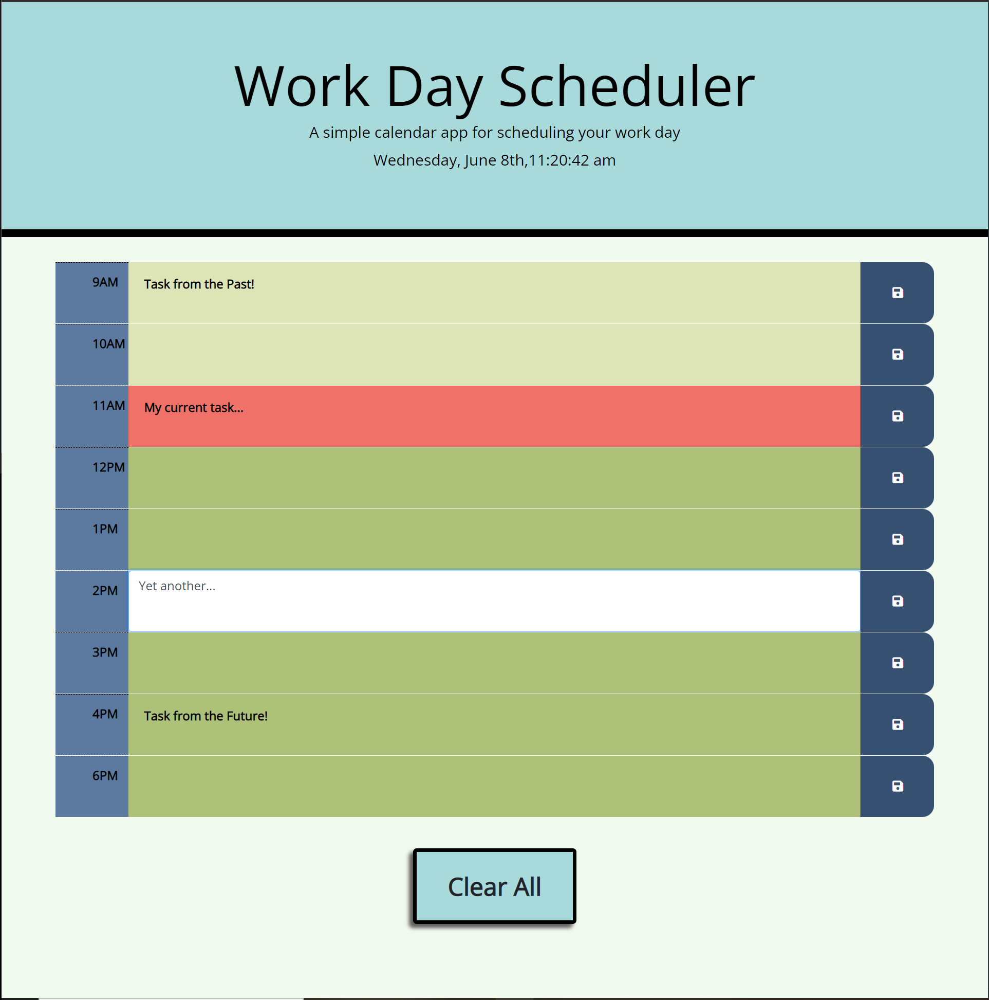

# all-in-a-days-work
A third-party API based work day scheduler.

My completed work day scheduler challenge.  Upon page load you are presented with the current day and date dynamically using moment().  Each time-block is color coded depending on whether it is currently in the past, present, or the future.  When you click on a colored time-block you are presented with an editable text field that you can manually enter text.  When you press the save button, the text is saved to local storage and persists on the screen upon screen refresh.  To edit the time-blocks simply press on them again and you will be presented with the text field again.

## Made With:

* HTML

* CSS

* Bootstrap

* JavaScript

* JQuery

## Website Url:

* https://bdunham484.github.io/js_code_quiz/

* Made with ❤️ by Brad Dunham
